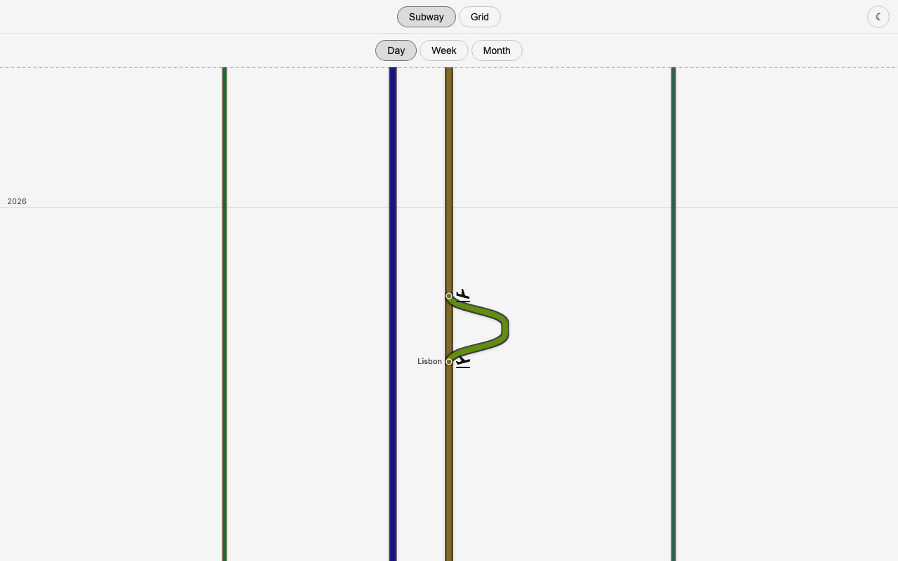
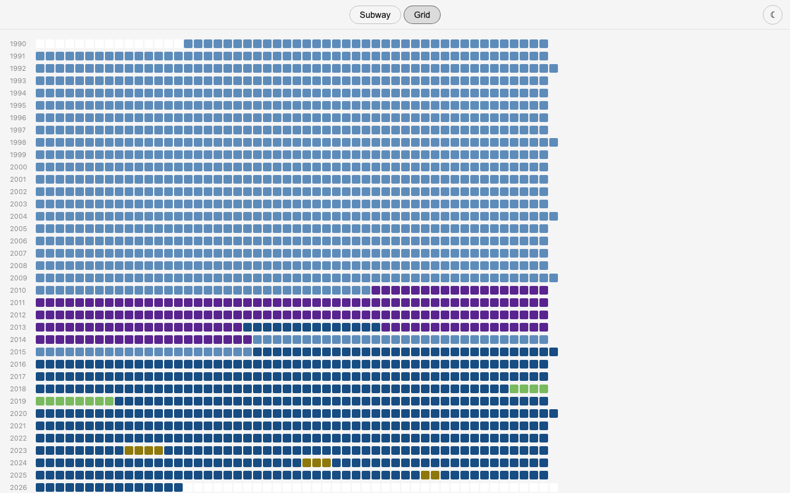

# Meridian

A personal life timeline visualization system that displays your events, activities, and milestones across two complementary views: a **subway map metaphor** for navigating life's story, and a **life in weeks grid** for zooming out to see your whole life at once.

## Two Ways to Visualize Your Life

### Subway View
Your timeline rendered as a subway map with branching lines (work, travel, hobbies, health, etc.), stations (events), and spans (multi-day activities). Zoom in and out by day/week/month to explore what happened during any period. Perfect for diving deep into a chapter of your life.



### Grid View
A "life in weeks" visualization inspired by [the Wait But Why blog post](https://waitbutwhy.com/2014/05/life-weeks.html). Each row is a year of your life; each cell is a week. At a glance, see which weeks were busy (colored), quiet, or just getting started. Click a week to see what happened. This view emphasizes the scarcity of time and the shape of your story.



## What Meridian Offers

- **Self-hosted, no vendor lock-in** — Run Meridian entirely on your own infrastructure. Single SQLite database, no complicated cloud dependencies. Your data stays under your control.
- **Granular visibility control** — Track all your life events privately, then share selectively. Mark events as public/friends/family/owner. Share custom read-only links scoped to specific audiences without needing accounts.
- **Integrate any data source** — Automatically import from Garmin, Strava, photos, calendars, and more. Meridian deduplicates and merges the same real-world event across multiple sources using configurable priority rules.
- **MCP-first event creation** — Add events via any MCP-compatible tool (Claude, custom AI assistants, CLIs). No proprietary integrations needed.
- **Customizable timeline branches** — Define your own timeline lines (work, travel, hobbies, health, etc.) with colors, labels, and merge/spawn behaviors via `config.yaml`.
- **Dual APIs** — REST (read-only, JWT-scoped, public-facing) and gRPC (write-capable, bearer-token auth, for importers and tools)
- **Multi-platform** — Web UI, Android app, CLI tools, and TypeScript MCP server

## Repository

A monorepo containing:

- **backend/** — Go gRPC/REST server
- **web-timeline/** — Vanilla JS web frontend
- **android/** — Android app
- **mcp/** — TypeScript MCP server
- **proto/** — Shared protobuf definitions (source of truth)

## Prerequisites

- [buf](https://buf.build/docs/installation) — `brew install bufbuild/buf/buf`
- Go 1.23+
- Node.js 20+
- Java 17+ (for Android)

## Proto codegen

Generated code is never committed. Run before building any component:

```bash
./generate.sh
```

## Components

See each component's `README.md` for details.
